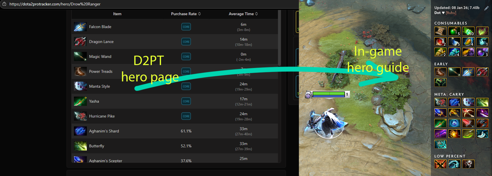

# 🔨 Item Builds

This script web-scrapes Dota 2 Pro Tracker (<https://dota2protracker.com/>) pages to create up-to-date hero item builds and directly imports them into Dota 2 local files.

## 🤓 Usage

1. Create a Python environment. For example, this repository is already set up with `uv`;
2. Rename `config.example.py` to `config.py`. Fill it with your own Hero + Role pairings;
3. Run the project, i.e. `uv run main.py`;
4. The item builds will be saved into `C:\Program Files (x86)\Steam\userdata\{FRIEND_ID}\570\remote\guides`.

## ⚠️ Warning

This script is quite lazy, i.e. It doesn't account for custom steam installation paths and some other sophisticated details,
so you might encounter some errors. Any PRs to improve the utility are welcome.
