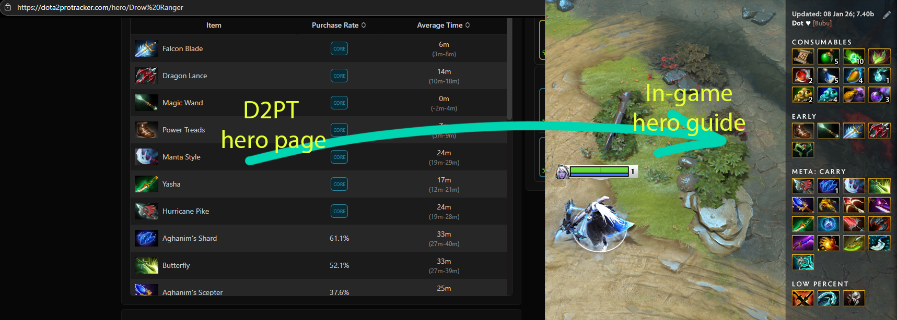

# 🔨 Item Builds

This script web-scrapes Dota 2 Pro Tracker (<https://dota2protracker.com/>) pages to create up-to-date hero item builds and directly imports them into Dota 2 local files.

## 🤓 Usage

1. Create a Python environment. For example, this repository is already set up with `uv`;
2. Rename `config.example.py` to `config.py`. Fill it with your own Hero + Role pairings;
3. Run the project, i.e. `uv run main.py`;
4. The item builds will be saved into `C:\Program Files (x86)\Steam\userdata\{FRIEND_ID}\570\remote\guides`.

## ⚠️ Warning

This script is quite lazy, i.e. It doesn't account for custom steam installation paths and some other sophisticated details,
so you might encounter some errors. Any PRs to improve the utility are welcome.

## ⏰ Task Scheduler

I tried to make `create_scheduled_task.bat` to automatically add a task into Windows' Task Scheduler but it doesn't quite work (help appreciated).

So I ended up adding it manually for myself.

Some short instructions

1. Task Scheduler -> Right Actions Panel -> Create Basic Task
2. Follow the steps. Notable things:
    * Action: Start a program
    * Program/script: `D:\CODE\Dota2Utils\ItemBuilds\.venv\Scripts\pythonw.exe` - `pythonw.exe` with `w` in the end for windowless task;
    * Add arguments `"D:\CODE\Dota2Utils\ItemBuilds\main.py"` - with quotes;
    * Start in `D:\CODE\Dota2Utils\ItemBuilds`
3. Important thing - on general tab, we need to choose a proper user (i.e. I have `"Me"`), otherwise it puts some `Medium Mandatory Level` group (???).
4. If we encounter any errors -> Open Event Viewer -> Application and Services Logs -> Microsoft -> Windows -> Task Scheduler -> Operational -> Right-Click + `Enable Log` and work with it, i.e. `Refresh`. I also left some screenshots in `assets` folder for future me.
