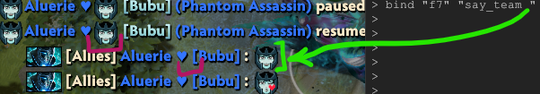

# List Emoticons for Dota 2

Updated fork of [ListEmoticons.ipynb](https://github.com/rossengeorgiev/dota2_notebooks/blob/master/List%20Emoticons.ipynb) by [@rossengeorgiev](https://github.com/rossengeorgiev). Maintained by [@Aluerie](https://github.com/Aluerie).

---

Scroll down the table, choose an emoticon you like - copy&paste the unicode character from the `chr` column into:

* into console for such binds as `bind o "say_team "` - this one is `:pa_kiss:`.  
* into your nickname - note that in this case emoticons will only show up in system-messages such as "Player paused the game". They will not show in chat, kill-feed or anywhere else really, only system messages.

It doesn't matter if you don't own the emoticon pack.

## Table of Dota 2 Emoticons

You can find the table with all emoticons here:

## [aluerie.github.io/Dota2Utils/ListEmoticons](https://aluerie.github.io/Dota2Utils/ListEmoticons)

🤓 If the table is outdated then hit me up with an issue or PR.
